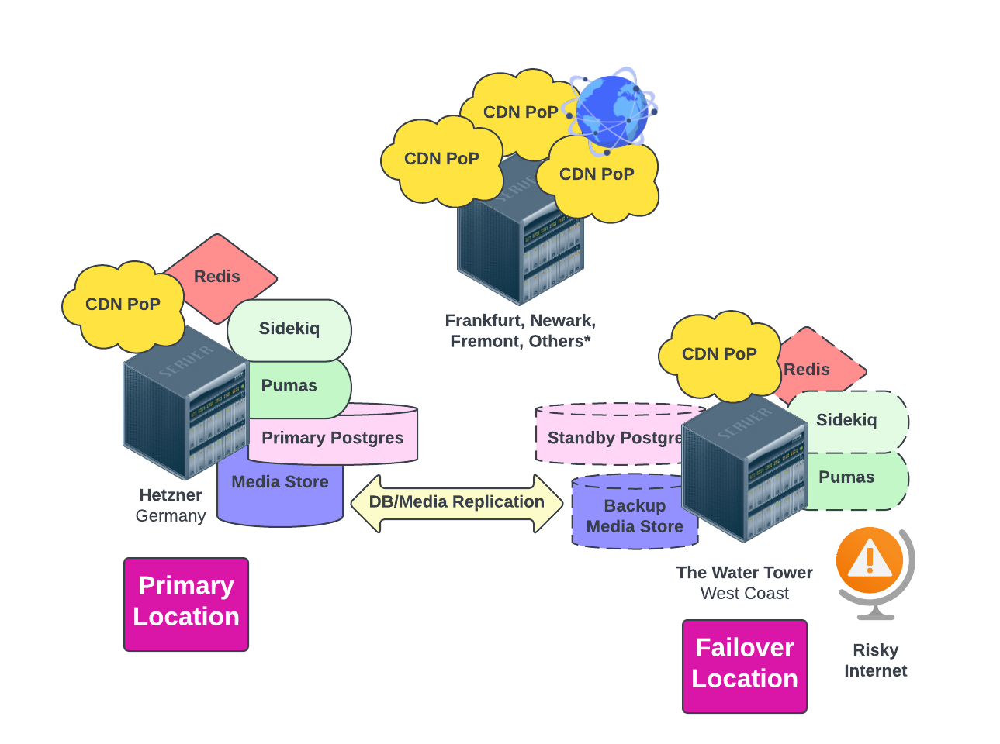

{}
<h5 class="text-center">This page was manually translated on 05/14/23.  Please utilize the English docs for the most up to date policies.</h5>
{}

{}
This page is still being built. Check back often.
{}

Hachyderm fait ces premiers pas vers ce que nous appelons **Open Source Infrastructure** où nous avons l’intention d’exploiter un service sécurisé et résilient entièrement dans le public.

## Hachyderm Aujourd'hui

Aujourd’hui, Hachyderm gère une topologie mondiale qui est répartie entre les fournisseurs de services suivants:

 - Serveurs sur site 'On premise' à Seattle, Washington, aussi connu sous le nom de "The Watertower".
 - 'Small lightweight' [Linode](https://www.linode.com/) VMs operating around the world.
 - Infrastructure de base fonctionnant avec [Hetzner](https://www.hetzner.com/) à Falkenstein, Allemagne.
 - Stockage d’Objets sponsorisé par [Digital Ocean](https://www.digitalocean.com/products/spaces).

### Expérimentation auprès du public

Hachyderm croit profondément qu’il reste de la valeur inexploitée en informatique. Nous avons l’intention d’aborder notre infrastructure comme une occasion d’expériences sûres et réfléchies, semblables à la façon dont la [Station Spatiale Internationale mène des expériences en orbite](https://www.nasa.gov/mission_pages/station/research/experiments_category). Nous avons l’intention de prototyper de nouvelles technologies, des modèles opérationnels, la structure organisationnelle du 'SRE', des modèles "Follow-The-Sun" et des flux de travail collaboratifs libres pour notre infrastructure. Au cours des prochains mois, nous partagerons les façons dont l’ensemble de la communauté Hachyderm peut se porter volontaire pour soutenir notre infrastructure, ainsi que les expériences fondées sur des hypothèses de registre, pour fonctionner avec nos données et nos services. 

Vos données utilisateur ne seront jamais utilisées pour une expérience. Toutes les données de profil d’utilisateur, les messages directs, le contenu de publication, les mesures d’accès, les détails démographiques et les renseignements personnels seront restreints à toute forme d’expérience. Pour être encore plus direct, vous, en tant qu’utilisateur de Hachyderm, ne serez jamais mis à profit dans une expérience. Nous n’expérimenterons pas sur vous. Nous expérimentons les outils et services qui soutiennent les services publics de Hachyderm tels que les bases de données de prototypage, les serveurs HTTP(s) et calculer les temps d’exécution (compute runtimes).
