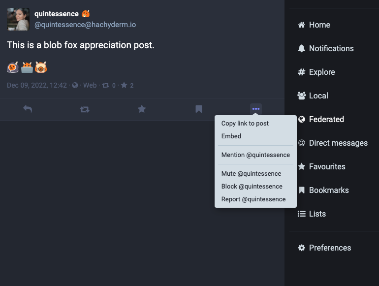
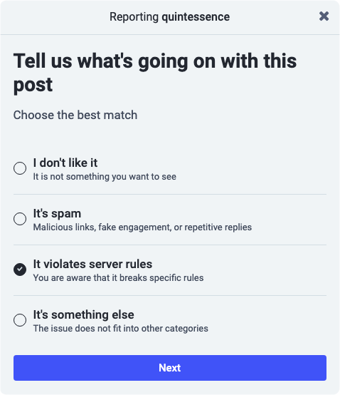
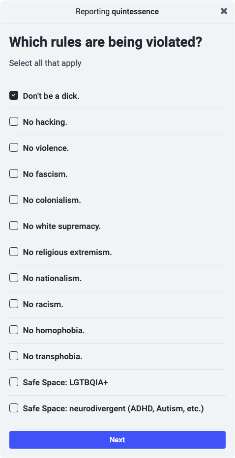
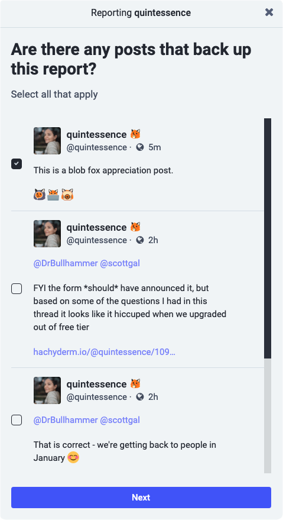
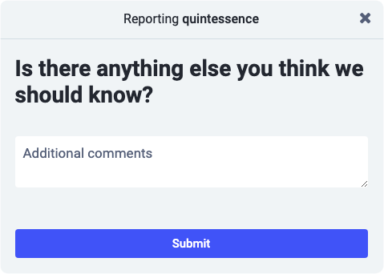
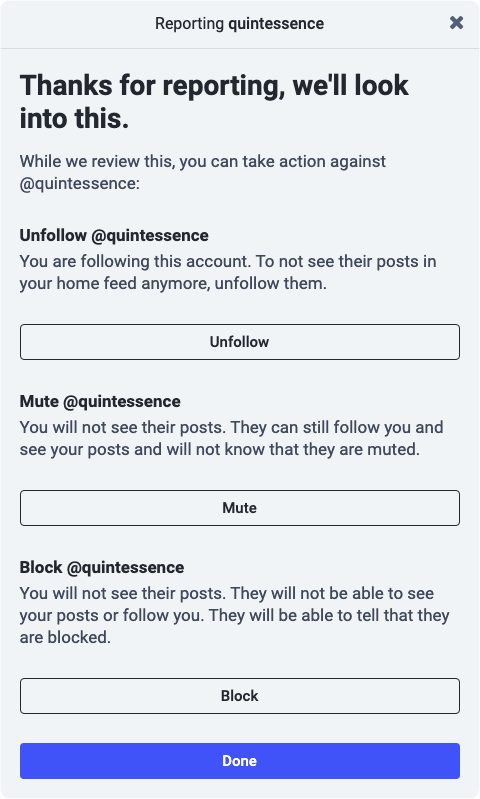
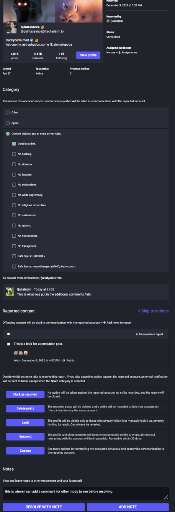
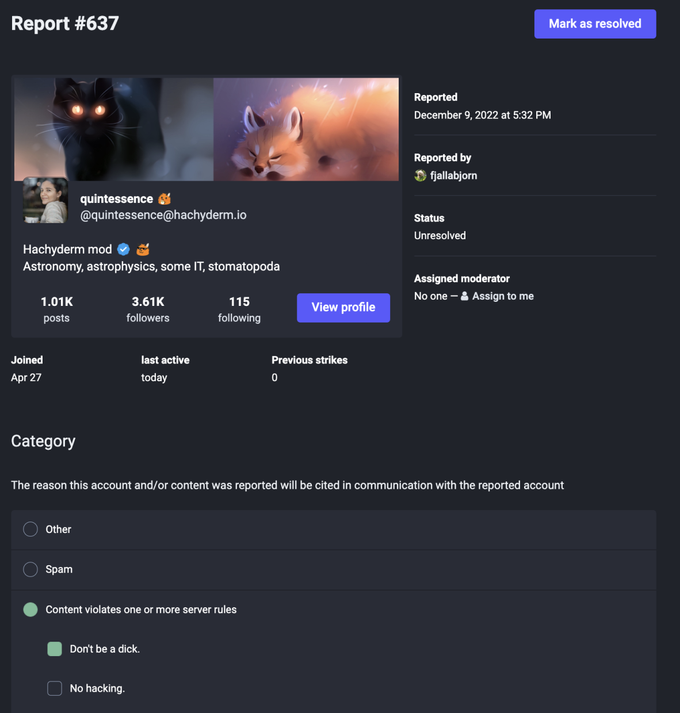
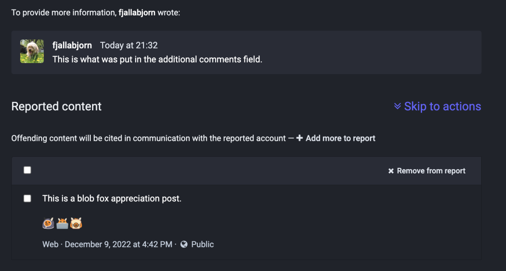
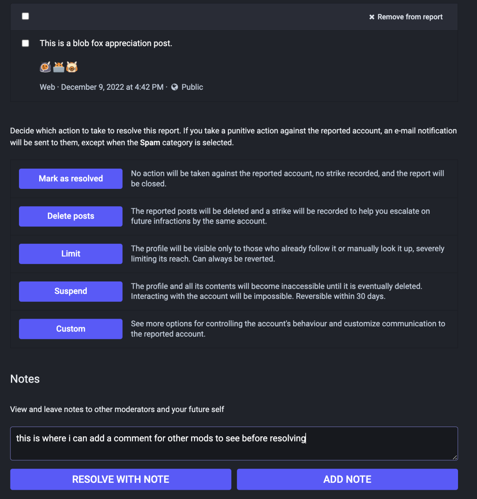

{}
<h5 class="text-center">This page was manually translated on 05/11/23.  Please utilize the English docs for the most up to date policies.</h5>
{}

{}
Cette section décrit les caractéristiques et les processus mis à jour par Mastodon. Pour tout problème lié à ces fonctions ou processus, veuillez communiquer directement avec l’équipe de Mastodon sur [GitHub du projet Mastodon](https://github.com/mastodon/mastodon).

Pour les problèmes avec cette page de doc elle-même, s’il vous plaît contactez-nous sur [Hachyderm’s Community Issue tracker](https://github.com/hachyderm/community/issues).
{}

## Sommaire <!-- omit in toc -->
- [À propos de la Fonctionnalité de Signalement](#à-propos-de-la-fonctionnalité-de-signalement)
- [Comment créer un Rapport](#comment-créer-un-rapport)
- [À Quoi Ressemble un Rapport Complété](#à-quoi-ressemble-un-rapport-complété)
    - [Qui Peut Voir les Rapports de Modération](#qui-peut-voir-les-rapports-de-modération)
    - [Limites de l’Interface d’Administration de Mastodon](#limites-de-linterface-dadministration-de-Mastodon)
    - [Une Dernière Chose](#une-dernière-chose)

## À propos de la Fonctionnalité de Signalement

La fonctionnalité de signalement de Mastodon permet aux utilisateurs de Mastodon d’envoyer des rapports aux administrateurs ou modérateurs d’une instance de Mastodon. Si vous signalez un utilisateur aux modérateurs de votre propre instance, alors seulement eux verront le rapport. Si vous signalez un utilisateur sur un serveur distant, les administrateurs de votre instance d’origine voient toujours le rapport. Dans le cas d’un utilisateur distant, vous pouvez également choisir de transmettre ou non le rapport aux administrateurs de cette instance. La nuance ici est de saisir si vous signalez un utilisateur à sa propre instance pour que ses administrateurs prennent des mesures, ou à vos propres administrateurs d’instance pour qu’ils prennent des mesures, ou les deux.

Sur Hachyderm, nous demandons expressément aux Hachydermiens d’utiliser la fonctionnalité de rapport pour les scénarios suivants :

* Signaler les publications individuelles, mais pas l’utilisateur dans son ensemble
* Signaler un utilisateur via ses publications
* Signaler un domaine via les messages d’un utilisateur sur ce domaine

Lors de la soumission d’un signalement, il est important d’inclure tous les renseignements pertinents. Cela comprend des informations à l’appui, même si cela semble évident, tous les messages pertinents au besoin, ainsi que vos commentaires.

**_Remarque : si nous recevons un rapport vide et que nous ne voyons pas de cause claire, nous fermerons le rapport sans intervention du modérateur._**

Pour de plus amples renseignements à ce sujet, veuillez consulter notre [doc. sur les questions de signalement et de communication avec les modérateurs](../../../moderation/reporting/).

## Comment créer un Rapport

1. Cliquez sur (...) menu sous le poste et sélectionnez "signaler"
  

1. Sélectionnez la raison de votre signalement. 

1. Si vous avez choisi Règles du Serveur pour la raison, comme nous l’avons fait dans cet exemple, alors il vous sera demandé de sélectionner laquelle et vous pouvez en sélectionner plus d’une : 

1. Veuillez sélectionner toutes les publications supplémentaires à inclure dans le rapport. 

1. Veuillez inclure tout le contexte pertinent pour nous aider à traiter le rapport : 

1. Vous pouvez **optionnellement** choisir de vous désabonner, de mute/désactiver ou de bloquer l’utilisateur avant de cliquer sur « Terminé ». 

L’étape des Commentaires Supplémentaires est très importante. Pour nous aider à traiter les rapports de façon efficace, il devrait toujours y avoir un contexte supplémentaire dans le champ Commentaires Supplémentaires - le plus possible. Cela doit être fait **_même si le rapport semble être explicite_**. Dans le cas de rapports de postes, d’utilisateurs et de domaines dans des langues autres que l’anglais, nous aurons besoin d’une traduction en anglais fournie.

La limitation la plus importante que vous devriez connaître à ce stade est que le champ Commentaires Supplémentaires a une limite de caractères, de 1000 caractères (à ce jour). Si vous avez besoin de fournir plus de contexte, ou la traduction prend plus de 1000 caractères, s’il vous plaît :

* Compléter le rapport avec ce que vous pouvez
* Assurez-vous de laisser suffisamment d’espace pour nous informer qu’il y a un courriel supplémentaire.
* Envoyez-nous un courriel à [admin@hachyderm.io](mailto:admin@hachyderm.io)

## À Quoi Ressemble un Rapport Complété

Par exemple, j’ai demandé à l’utilisateur de Björn de créer un rapport contre mon Blob
Fox Appreciation Post que j’ai utilisé pour les captures d’écran ci-dessus. Quand un membre de l’équipe de modération examine le rapport, ça ressemble à
ceci :

Comme il s’agit d’une vue très agrandie, examinons chacune des sections. En haut, vous trouverez les mêmes renseignements que si vous naviguez vers le haut de la page du profil d’un utilisateur :

Cette section montre également à l’équipe de modérateur pourquoi le rapport a été déposé, dans ce cas, la règle "Don’t Be A Dick" est sélectionnée.

En dessous se trouve le commentaire fourni par l’utilisateur lorsqu’il a déposé le rapport ainsi que tous les postes qu’il a choisi d’inclure avec lui. Si l’utilisateur est un Hachydermien, le nom d’utilisateur est fourni comme vous pouvez le voir ici. Si l’utilisateur est hors de notre serveur, seul le serveur source est fourni.

Au bas se trouve la section où les modérateurs peuvent laisser des commentaires et choisir les mesures à prendre :

Les modérateurs peuvent choisir de clore le problème "issue" avec seulement un commentaire explicatif, ou de prendre l’une des mesures indiquées et de clore le problème "issue".
Pour la visibilité, les actions de modération sont :

1. Marquer comme résolu (aucune mesure de modération)
1. Supprimer les postes (mods résolvent en supprimant le poste(s) offensant)
1. Limite (Anciennement connu sous le nom de « silence ». L’utilisateur peut toujours participer, mais il ne s’affichera pas dans les flux Locaux ou Fédérés.)
1. Gel (l’Utilisateur peut ouvrir la session de leur compte, mais ne peut pas interagir)
1. Avertissement (les Mods envoient une note à l’utilisateur signalé par l’intermédiaire de l’interface. Notez que cette option n’est pas visible sur la capture d’écran.)
1. Suspendre (Aussi appelé « ban ». Si l’utilisateur est un hachydermien, son compte est supprimé de notre serveur. S’il est sur un serveur différent, il est interdit à l’utilisateur d’interagir avec notre serveur.)

Parmi les actions ci-dessus, les seules actions de modération qui sont visibles sont si un mod supprime un poste ou suspend un compte. Lorsqu’un problème est clos sans action ou lorsqu’un utilisateur est averti, gelé ou limité, l’action n’est pas visible pour l’utilisateur déclarant ou les autres utilisateurs. Cela signifie que nous ou les mods de votre instance avons peut-être pris des mesures à la suite de votre rapport, mais que ces mesures ne sont pas visibles publiquement.

Veuillez consulter [notre doc Actions et Appels](../../../moderation/actions-and-appeals/)
pour en savoir plus sur la façon dont nous utilisons les outils de modération pour modérer Hachyderm.

#### Qui Peut Voir les Rapports de Modération

Si vous signalez un utilisateur sur la même instance que vous (utilisateur local) :

* Les mods de l’instance peuvent voir votre rapport

Si vous signalez un utilisateur _pas_ sur la même instance que vous (utilisateur distant) :

* Les mods de votre instance peuvent voir votre rapport
* Les mods d’instance distante / les mods de l’instance de l’utilisateur signalé ne peuvent voir le rapport que si vous le transmettez.

Les utilisateurs réguliers **_n'ont pas_** accès aux rapports de modération.

#### Limites de l’Interface d’Administration de Mastodon

Lorsque nous recevons un rapport dans les outils d’administration, il y a deux inconvénients principaux :

* Nous ne pouvons pas faire de suivi auprès de l’utilisateur déclarant pour demander des informations complémentaires
* Nous ne pouvons pas faire de suivi auprès de l’utilisateur déclaré, même s'il fait appel.

Comment cela vous touche :

* Si vous signalez un problème et que vous n’incluez pas suffisamment d’information ou de moyen pour nous de communiquer avec vous pour obtenir des précisions, nous pourrions ne pas être en mesure de prendre les mesures appropriées.
* Si vous faites appel pour une décision de modération et que vous ne nous fournissez pas suffisamment d’information pour que nous puissions prendre une décision et communiquer avec vous, il se peut que nous n’ayons pas suffisamment d’information pour annuler la décision et qu’il soit impossible de vous demander plus d’information.

#### Une Dernière Chose

**_Si nous recevons un rapport vide et que nous ne voyons pas de cause claire, nous fermerons le rapport sans mods intervention._**
