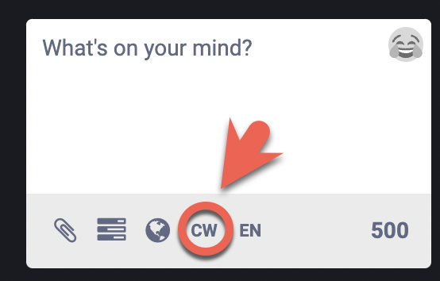
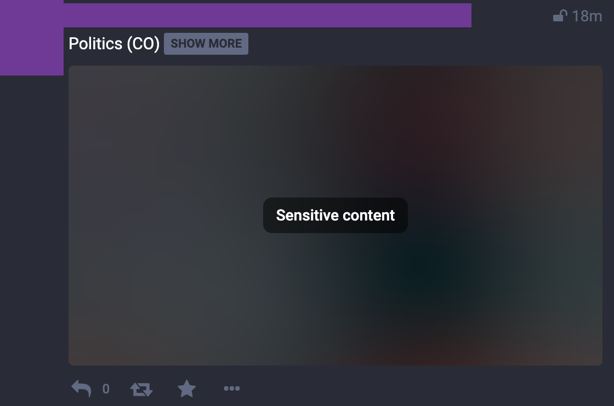
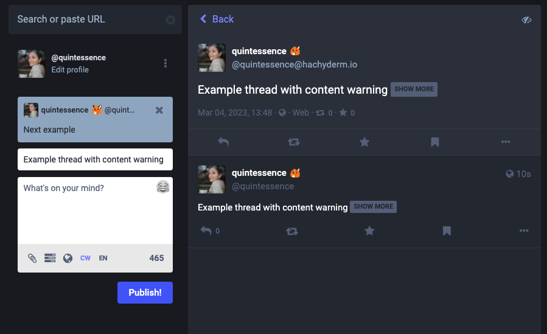

{}
Cette page documente les fonctionnalités et les processus gérés par Mastodon. 
Pour les questions liées à ces fonctionnalités et/ou processus, veuillez contacter l’équipe Mastodon directement sur le projet [GitHub Mastodon](https://github.com/mastodon/mastodon). 

Pour les problèmes avec cette page de doc elle-même, s’il vous plaît, contactez-nous sur [Hachyderm’s Community Issue tracker](https://github.com/hachyderm/community/issues).
{}

{}
<h5 class="text-center">This page was manually translated on 05/08/23.  Please utilize the English docs for the most up to date policies.</h5>
{}

## Que sont les Avertissements de Contenu ?

Avertissements de Contenu est une fonctionnalité qui vous permet d’obscurcir votre contenu de manière à ce qu’il soit caché par défaut dans les "timelines" des autres utilisateurs. Au lieu de cela, seul le texte de l’avertissement de contenu est affiché. Autrement dit, si vous mettiez un avertissement de contenu sur l’un de vos messages qui dit « descriptions de la violence de guerre » pendant que vous discutez des guerres actuelles ou passées, les utilisateurs ne verraient que cette description et pourraient ensuite cliquer sur l’avertissement de contenu pour voir le contenu. (ou non).

## Comment appliquer un avertissement de contenu ?

Pour appliquer un avertissement de contenu, utilisez le "CW" dans le champ post :

Un exemple de publication avec un avertissement de contenu sur le texte et l’image ressemble à ceci :

## Threads(Fils) avec un avertissement de contenu

Chaque fois que quelqu’un répond à un message avec un avertissement de contenu, par défaut sa réponse portera le même avertissement de contenu. Voici un exemple :

Ceci est la valeur par défaut en raison de la nature de l’avertissement de contenu : 
si la publication la plus importante d’un thread a besoin d’un avertissement de contenu en raison de ce qui est affiché ou discuté, alors le reste de ce thread a _probablement_ besoin du même avertissement de contenu. Ceci est alors vrai pour quand vous répondez à vos propres messages ou quand d’autres utilisateurs répondent à vos messages.

Lorsque vous répondez à un message avec un avertissement de contenu, vous pouvez désactiver et supprimer manuellement l’avertissement de contenu, mais veuillez le faire avec précaution. Lorsque vous supprimez l’avertissement de contenu de votre message, toutes les réponses _à vous_ ne seront _également plus_ derrière un avertissement de contenu par défaut, même si elles devraient être.
## Quand les Avertissements de Contenu sont-ils utilisés ?

Avertissements de Contenu sont généralement utilisés pour cacher les spoilers ou pour fournir un "buffer"(tampon) lorsqu’il est psychologiquement plus sûr de choisir de participer à une conversation, plutôt que d’être choisi par défaut (le voir dans une timeline). Pour plus d'information sur la nuance, pour savoir comment et quand utiliser les Avertissements de Contenu, veuillez consulter notre [doc sur l’utilisation des Avertissements de Contenu](/docs/hachyderm/content-warnings/).
