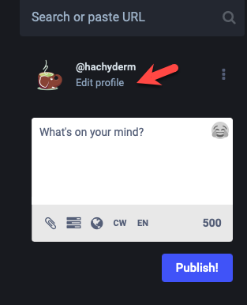
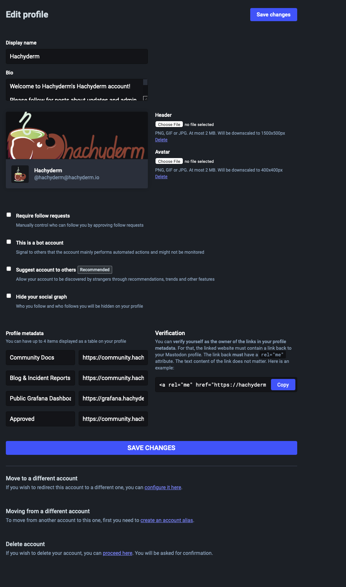
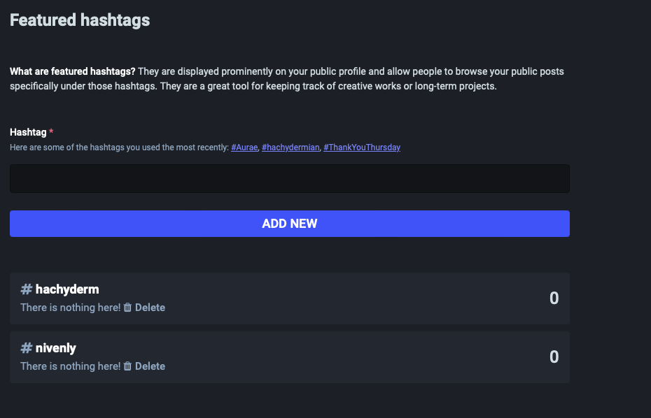
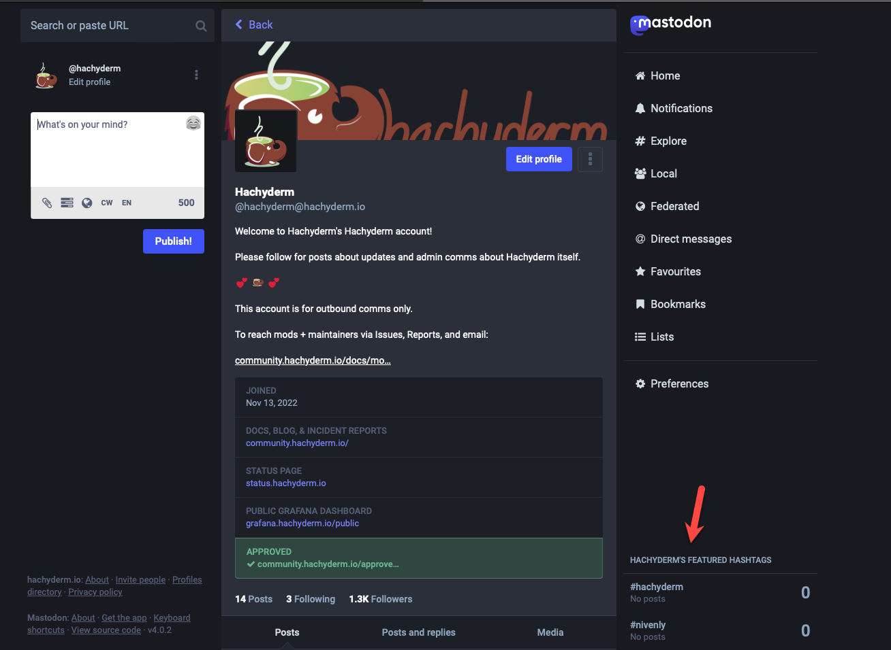
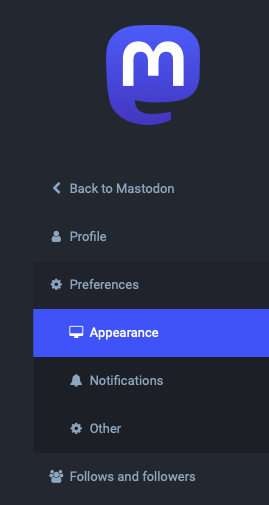
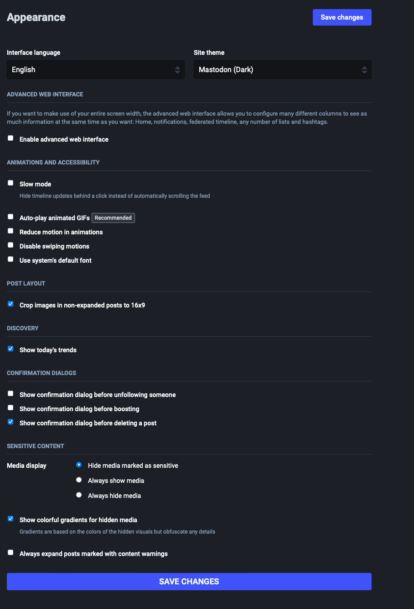
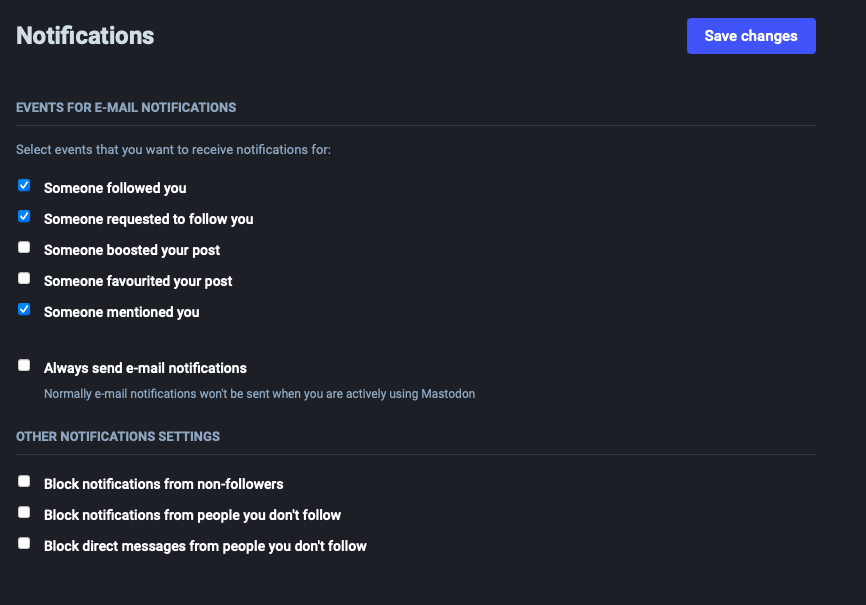
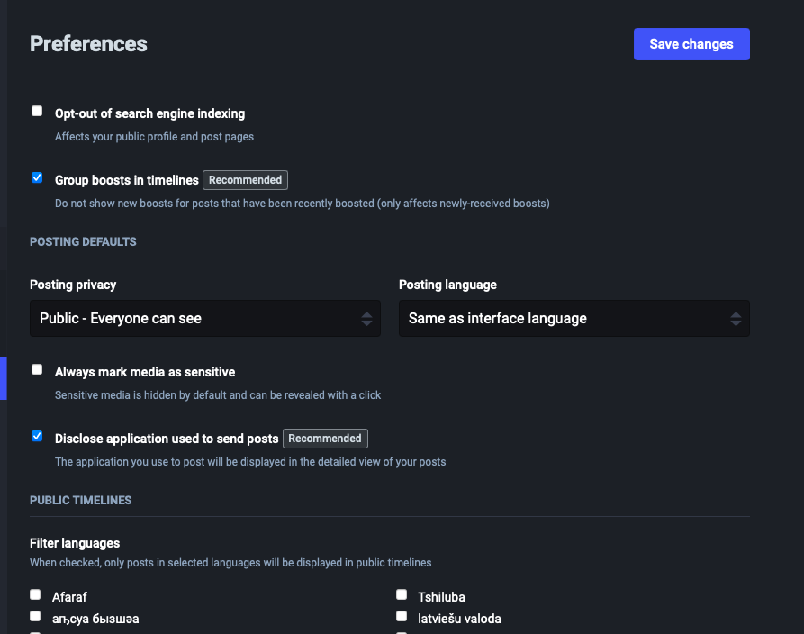

{}
<h5 class="text-center">This page was manually translated on 05/12/23.  Please utilize the English docs for the most up to date policies.</h5>
{}

{}
Cette section décrit les caractéristiques et les processus mis à jour par Mastodon. Pour tout problème lié à ces fonctions ou processus, veuillez communiquer directement avec l’équipe de Mastodon sur [GitHub du projet Mastodon](https://github.com/mastodon/mastodon).

Pour les problèmes avec cette page de doc elle-même, s’il vous plaît contactez-nous sur [Hachyderm’s Community Issue tracker](https://github.com/hachyderm/community/issues).
{}

## Overview <!-- omit from toc -->

Cette page de documentation couvre les options de personnalisation disponibles via les paramètres Profil et Préférences. La majorité de la longueur de l’article est due à des captures d’écran qui montrent la vue principale pour chaque page de paramètres. Tous les paramètres affichés dans les captures d’écran sont les paramètres par défaut, fait pour les besoins de cet article. Ce document fournit uniquement du texte explicatif lorsque la fonction activée ou désactivée n’est pas auto-descriptive.

- [Paramètres du Profil](#paramètres-du-profil)
  - [Apparence](#apparence)
  - [Hashtags Mis en Avant](#hashtags-mis-en-avant)
- [Paramètres des Préférences](#paramètres-des-préférences)
  - [Apparence](#apparence-1)
  - [Notifications](#notifications)
  - [Autre](#autre)

## Paramètres du Profil

Pour modifier les paramètres de votre profil, vous pouvez cliquer sur le texte "Modifier le profil" sous votre nom public sur le côté gauche, comme ceci :

Sinon, vous pouvez aller à la [paramètre/profil](https://hachyderm.io/settings/profile) endpoint directement dans votre navigateur.

### Apparence

Quand vous allez à [paramètre/profil](https://hachyderm.io/settings/profile), par défaut, vous serez redirigé vers
les paramètres du Profil <i class="fas fa-arrow-right"></i> Apparence:

Pour récapituler ce qui précède, voici où vous pouvez :

* Définissez votre nom d’affichage
* Écrivez votre biographie
* Téléchargez vos images d’en-tête et d’avatar
* Activer ou désactiver les demandes d'abonnement  
  * Désactivé par défaut. Les comptes pourront suivre votre compte sans approbation explicite.  
    Lorsque cette option est activée, vous serez invité à approuver ou à refuser les demandes d'abonnement.
* Définir si vous êtes un robot 
  * Désactivé par défaut. Lorsqu’il est activé, votre compte s’affiche avec le mot "bot" à côté de votre nom public et s’afficher sur votre profil. Aucun autre changement n’est apporté à votre compte.
* Suggérer votre compte à d’autres 
  * Désactivé par défaut. Une fois activé, votre compte sera recommandé à d’autres comptes en tant que compte à suivre.
* Masquer votre graphique social 
  * Désactivé par défaut. Lorsqu’il est activé, les autres utilisateurs ne pourront pas voir qui vous suivez ou qui vous suit.
* Rédiger les métadonnées de votre profil
  * Cela vous permet d’entrer des informations qui sont rendues comme des tags « key : value ». 
    Pertinent, lorsque vous ajoutez des URL, c’est également là que la zone de texte devient verte lorsque [vérifié](/docs/mastodon/user/verification).
* Migrer vers un autre compte ou lier vers un compte à partir duquel vous migrez
* Supprimer votre compte 
  * :attention: La suppression de compte fonctionne différemment de la suspension de compte. Lorsque vous supprimez votre compte, vos données sont supprimées **__immédiatement_** et non après une période de 30 jours. En outre, il y a des rapports incohérents lorsque les comptes supprimés sont ressuscités, car ils peuvent ne pas se fédérer correctement selon la façon dont les serveurs distants de ce compte mettent à jour leurs informations sur le compte qui n’est plus supprimé (ou pas).

### Hashtags Mis en Avant 

La configuration de hashtags sont votre capacité à diriger quels hashtags apparaissent sur votre vue principale. Ils sont configurés par
les hashtags mis en avant figurant dans le menu de navigation sous Profil 

Hashtags mis en avant sont votre capacité à diriger quels hashtags apparaissent sur votre vue principale. Ils sont configurés par
les hashtags mis en avant figurant dans le menu de navigation sous Profil <i class="fas fa-arrow-right"></i> Apparence.
Cette page est également accessible directement via [settings/featured_tags](https://hachyderm.io/settings/featured_tags).

Lorsque vous saisissez des hashtags pour afficher votre vue principale, ils apparaissent en bas à droite :

Notez dans ce cas le texte descriptif "Hashtags Mis en Avant d'Hachyderm" désigne Hachyderm en tant que Nom public du compte et pas
Hachyderm au niveau de l’instance.

## Paramètres des Préférences

Les Paramètres des préférences se trouvent immédiatement sous les paramètres du Profil dans le menu de navigation de gauche.

### Apparence

Lorsqu’il est sélectionné, les paramètres d’Apparence (à ne pas confondre avec ce qui précède) s’affichent par défaut. Cette page peut
être également accessible via [settings/preferences/appearance](https://hachyderm.io/settings/preferences/appearance).

Pour récapituler ce qui précède, voici où vous pouvez :

* Définir la langue de votre interface
* Définir le thème de votre site (clair ou sombre)
* Activer l’interface web avancée
  * Désactivé par défaut. Cela vous permet d’épingler et de visualiser plusieurs colonnes. Veuillez consulter la [Documentation Mastodon sur les préférences utilisateur](https://docs.joinmastodon.org/user/preferences/)
    pour plus de détails.
* Activer le mode lent
  * Cela empêche l’affichage de la ligne de temps (timeline) de s’actualiser automatiquement.
* Activer la lecture automatique des GIF animés
* Défini pour réduire le mouvement dans les animations 
  * Ceci est spécifique à la réduction du mouvement des GIF animés. <!-- FIXME: need to test what this means. Slower? Only loops once? -->
* Désactiver les mouvements de balayage
  * Cela est spécifique à l’utilisation de navigateurs avec des appareils dotés d’une fonction de balayage. Lorsqu’il est activé, il vous empêche de changer accidentellement de timeline lors de l’utilisation d’un mouvement de balayage pour "revenir en arrière".
* Utiliser la police du système
  * Lorsqu’il est activé, il utilise la police par défaut de Mastodon (Roboto).
* Activer la taille de l’image rognée
* Montrer les tendances
* Activez la confirmation avant de suivre quelqu’un
* Activer la confirmation avant de partager
* Activer la confirmation avant de supprimer une publication 
* Définir le mode d’affichage du support
  * La valeur par défaut est "masquer les supports marqués comme sensibles". Permet spécifiquement de toujours afficher les médias, de toujours masquer les médias ou de masquer les médias uniquement lorsque l’affiche indique que les médias sont sensibles.
* Activer si vous souhaitez un dégradé de couleur pour les supports masqués
* Activer si vous souhaitez que les publications soient étendues avec des avertissements de contenu

### Notifications

Accessible via Preferences <i class="fas fa-arrow-right"></i> Notifications. Peut également être directement accessible via
[settings/preferences/notifications](https://hachyderm.io/settings/preferences/notifications). Ces préférences
sont séparés des préférences de Notifications que vous pouvez faire lors de la visualisation dans la vue Timeline.

Pour récapituler ce qui précède, voici où vous pouvez :

* Activer ou désactiver les notifications par courriel pour :
  * Quelqu’un vous suit
  * Quelqu’un demande à vous suivre
  * Quelqu’un qui vous partage
  * Quelqu’un qui favorite une publication
  * Quelqu’un qui vous mention
* Outrepasser ce qui précède dans les cas où :
  * Le compte ne vous suit pas
  * Vous ne suivez pas le compte
* Bloquer les messages directs des personnes que vous ne suivez pas

Pour les deux fonctionnalités de la section "override" ci-dessus, cela signifie que si vous avez activé les notifications pour les partages et
également activé "bloquer les notifications de non-suiveurs", alors vous ne verrez les notifications pour quand vos abonnés
vous partage.

### Autre

Situé à Preferences <i class="fas fa-arrow-right"></i> Autre ou [settings/preferences/other](https://hachyderm.io/settings/preferences/other).

Pour récapituler ce qui précède, voici où vous pouvez :

* Refus de l’indexation des moteurs de recherche
* Grouper les partages dans les timelines
  * Activé par défaut. Lorsque activé, si plusieurs personnes ont partagé le même poste dans un court laps de temps, vous verrez
    un seul des partages plutôt que tous les partages séparément.
* Définissez votre confidentialité par défaut
  * Les options d’affichage sont les suivantes : 
    Public 
    Non répertorié 
    Privé
* Définir la langue d’affichage par défaut
* Définir si vous voulez que tous vos medias soient marqués comme sensibles
* Divulguer quelle application vous utilisez pour publier
* Langues de filtrage
  * Veuillez noter que les langues ne sont pas toutes saisies dans la capture d’écran en raison de leur longueur.