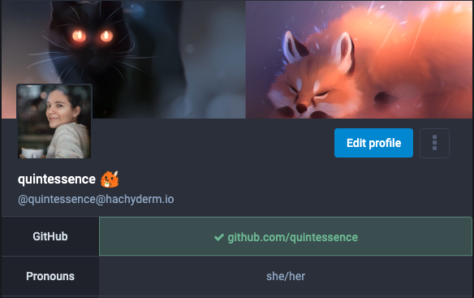
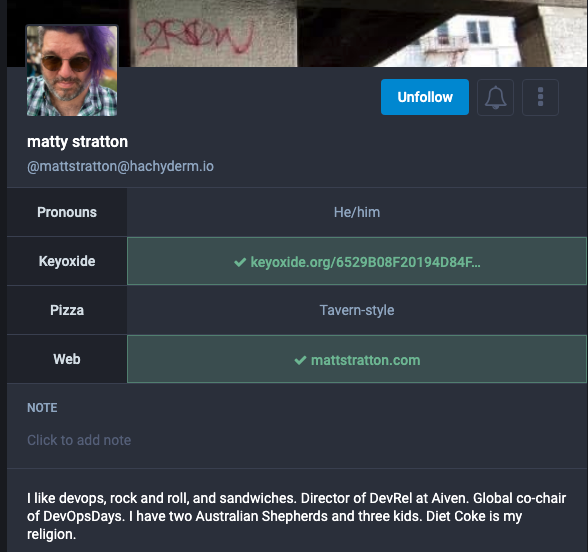
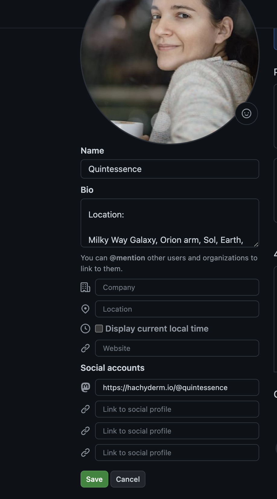

{}
<h5 class="text-center">This page was manually translated on 05/12/23. </br>Please utilize the English docs for the most up to date policies.</h5>
{}

{}
Cette section décrit les caractéristiques et les processus mis à jour par Mastodon. Pour tout problème lié à ces fonctions ou processus, veuillez communiquer directement avec l’équipe de Mastodon sur [GitHub du projet Mastodon](https://github.com/mastodon/mastodon).

Pour les problèmes avec cette page de doc elle-même, s’il vous plaît contactez-nous sur [Hachyderm’s Community Issue tracker](https://github.com/hachyderm/community/issues).
{}

## Qu’est-ce que la vérification?

La vérification sur Mastodon fonctionne moins comme Twitter et plus comme un service d’identité. Autrement dit, vous n’avez pas besoin de prouver votre association avec votre propre marque à une entité ou de payer des frais, vous montrez seulement que vous êtes le propriétaire d’un (ou plusieurs) domaines ou des comptes sur des services distincts pour justifier votre identité numérique.

Voici à quoi cela ressemble quand un profil a été vérifié via leur identité GitHub :



GitHub s’affiche comme vérifié avec une _checkmark_ verte un URL complet, y compris le nom d’utilisateur / handle.

### Quels domaines ou comptes, pouvez-vous vérifier?

Vous pouvez vérifier via :

* Tout domaine pour lequel vous pouvez modifier des pages
* Tout service en ligne qui reconnaît, fournit ou permet de fournir l’attribut « rel me » (voir ci-dessous).

## Comment vérifier

### Vérification avec les domaines

En général, lorsque vous vérifiez, vous le ferez en utilisant le HTML suivant sur la page que vous éditez, comme un site personnel ou un blog :

```html
<a rel="me" href="https://hachyderm.io/@nomutilisateur">Hachyderm</a>
```

Si vous souhaitez éviter d’utiliser un lien visible, comme ci-dessus, vous pouvez également mettre ce qui suit dans les en-têtes de page :

```html
<link rel="me" href="https://hachyderm.io/@nomutilisateur">
```

Après avoir fait l’un ou l’autre des éléments ci-dessus, vous devrez ajouter l’URL du site à votre profil Hachyderm / Mastodon. Vous le ferez en :

1. Allez à Modifier le Profil.
2. Dans l’un des quatre champs des métadonnées de profil, ajoutez l’URL de la destination que vous vérifiez.
3. Enregistrer les changements

Voici un exemple de profil avec deux sources distinctes de vérification de l’identité :



<small>Capture d’écran du profil utilisateur de Hachyderm prise avec permission.</small>

### Vérification auprès des services

Nous ajouterons d’autres services à la demande de la Communauté soit en
[créant une "issue" sur notre _Community Issue Tracker_](https://github.com/hachyderm/community/issues) ou via un direct [_Pull Request_ sur le repo de la Communauté](https://github.com/hachyderm/community/pulls).

Les instructions pour les services courants, communément demandés, sont ci-dessous.

Comme pour le processus de vérification lui-même : **lors de la vérification avec un service, ce service est responsable d’aider avec les erreurs ou les problèmes de vérification. Si vous éprouvez des problèmes avec le processus de vérification, veuillez communiquer avec le service concerné pour obtenir de l’aide.**

#### GitHub

Au début de 2023 GitHub a annoncé un support d'intégration pour plusieurs URL sociales, y compris l’ajout de support pour Mastodon spécifiquement. Afin de vérifier via GitHub :

1. Allez à votre page de profil GitHub et cliquez sur "Modifier"
1. Fournissez l’URL de votre compte Hachyderm du format </br>« https://hachyderm.io/@NOMUTILISATEUR »
1. Cliquez sur Enregistrer.

Une fois que vous avez enregistré, votre profil GitHub devrait maintenant afficher votre compte Mastodon au format « @NOMUTILISATEUR@hachyderm.io ».

**Visuellement**

Lorsque vous modifiez, ça ressemblera à ceci :



Une fois enregistré, votre compte Hachyderm ressemblera à ceci :


